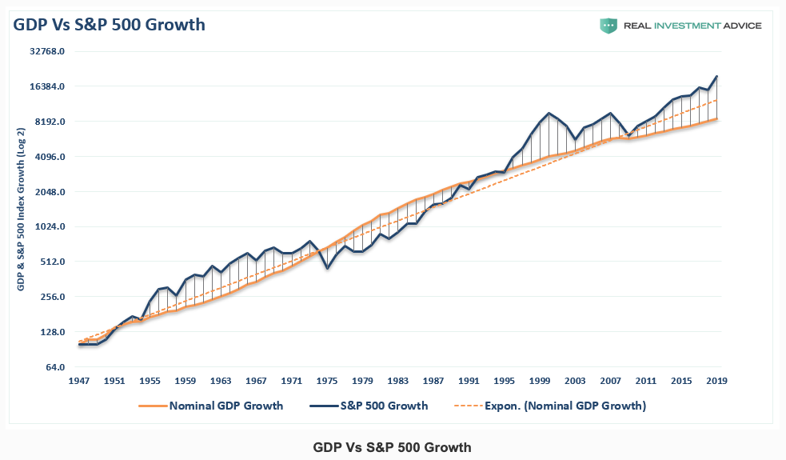
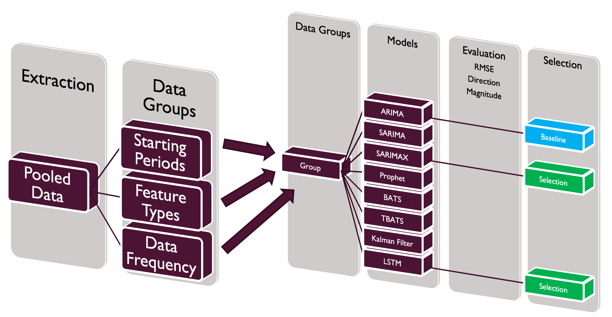
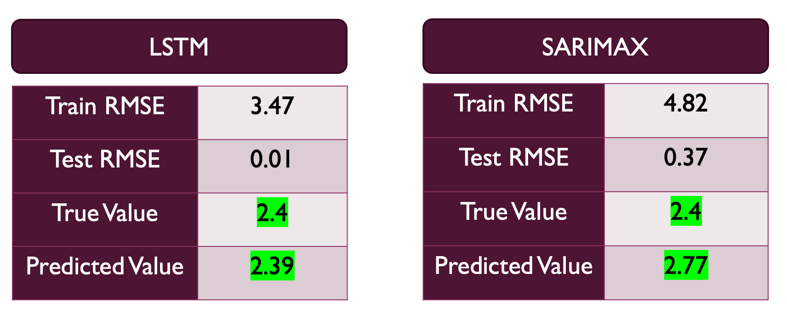

# Quantifying Future GDP

In this project, I will be attempting to predict future US GDP in order to reasonably quantify the future global economic growth in order to make better investment decisions today.

I will be predicting future US Quarterly GDP on a percentage basis, relative to its prior reading. This is so because the absolute figure for GDP is irrelevant when using future US GDP as a risk management tool. What the stakeholder would be interested in would be whether GDP is growing, slowing or shrinking, relative to its prior reading and not how large future GDP will be in dollar terms.

The main point of this project would be to predict quarterly GDP as this is the metric that is reported by the [BEA](https://www.bea.gov/data/gdp/gross-domestic-product) on a quarterly basis.

By offering insights on future quarterly GDP before actual GDP is reported, we stand to be in a position of making a better informed investment decision in an uncertain environment, and when applied appropriately, the insights could lead to positive and meaningful outcome for its intended user.

# Supporting Research

You may find a list of supporting research used for this project here:

1. [TATA Group Invests in Gigafactory in the UK]((https://www.cnbc.com/2023/07/19/indias-tata-group-to-build-5-billion-gigafactory-in-the-uk.html))
2. [Is the World Economy Dependent on America?](https://www.managementstudyguide.com/world-economy-dependent-on-america.htm)
3. [EU & US trade](https://www.eeas.europa.eu/united-states-america/european-union-and-united-states_en?s=253#:~:text=Deep%20Economic%20Ties,-The%20EU%2DUS&text=The%20EU%20and%20the%20United%20States%20are%20each%20other's%20main,investment%20markets%20of%20first%20choice.)
4. [Singapore's Top Trading Partners](https://www.singstat.gov.sg/modules/infographics/singapore-international-trade#:~:text=In%202022%2C%20Mainland%20China%2C%20Malaysia,exports%20to%20these%20trading%20partners.)

5. # Background

## Investing is Risk Management

Investing is a difficult task to carry out successfully. On a personal level, I feel that the term 'investing' is somewhat of a misnomer by itself. Although the act of investing involves an entity or person to utilise capital in order to realise a favorable future outcome, hence the term 'invest', the primary factor that determines the success of an investment is how well its associated risks are defined and managed. Investing for a favorable future outcome requires rigorous risk management. This is so because often, investors are required to make investment decisions in an uncertain and dynamic environment.

There are many uncertainties or risks that needs to be understood on a granular level and if the investor fails to understand these risks and account for them, they may be setting themselves up for a failed investing endeavor even before they begin.

One of the most fundamental risk that an investor or steward of capital needs to appreciate is future demand or future economic growth. If the CEO of an automobile company or the Chief Investing Officer of a hedge fund decides to invest significant sums of money to expand their business or to generate returns for their clients/shareholders, he or she needs to be able to appreciate that at a fundamental level, there must growing economic demand to support the basis for expansion or investment.

If these persons are able to assess with accuracy whether future GDP is growing or shrinking, they would be able to make a more informed decision even in periods of uncertainty where GDP has yet to be reported and make better investment decisions to realise a probabilistically better outcome.

## Predicting US GDP For All Stakeholders

Investing does not need to be restricted in its definition in the sense where an invester invests in financial markets through financial securities such as equities or fixed income assets. An investment can also come in the form of capital expenditure, factory expansions, hiring of employees etc.

Investing today to achieve an envisioned future outcome is a difficult task to accomplish across sectors or industries. An applicable example is when an Indian multi national corporation, TATA group, making the [decision](https://www.cnbc.com/2023/07/19/indias-tata-group-to-build-5-billion-gigafactory-in-the-uk.html) to invest in UK and build a $5 billion gigafactory there, one of Europe's largest.

One of the very basic questions that needs to be answered in this example is:

**"Would Europeans demand to purchase more electric vehicles increase, and in turn drive increased demand for more batteries produced from their gigafactory in future?".**

The answer to the question is very much rooted in whether people would be able to afford to buy an electric vehicle in the future and that very much depends on whether their economic prospects are secure and growing. If we are able to understand on a very fundamental level that the average European is looking forward to growing and rising economic prospects, then it is reasonable to say that the average European would then be able to afford and purchase an electric vehicle, driving increased demand for the batteries the gigafactory produces, all else being equal.

Such insights can be a powerful tool to establish a fundamental baseline of what to expect economically in the future. 

In a counter example, one can then come to the conclusion that if the [US economy (GDP) and by extension a significant part of the world's economy](https://www.managementstudyguide.com/world-economy-dependent-on-america.htm) is predicted to weaken significantly, it would not make sense for TATA group to invest $5 Billion in a gigafactory in the UK. Postponing the project or re-pricing it for lower input costs while waiting for a recovery in projected economic growth would make much more sense than investing into a global economy with weakening demand. 

To provide empirical evidence on the effects of GDP growth and company earnings, the [chart](https://www.investing.com/analysis/sotm-2020-state-of-the-markets-200505115) below proves that a correlation exists between the two over time. 

    

## US Economy Drives Global Growth, Including Singapore

The relationship between Europe and US GDP are apparent because [The EU and the United States are each other’s main trading partners and account for the largest bilateral trade relationship in the world](https://www.eeas.europa.eu/united-states-america/european-union-and-united-states_en?s=253#:~:text=Deep%20Economic%20Ties,-The%20EU%2DUS&text=The%20EU%20and%20the%20United%20States%20are%20each%20other's%20main,investment%20markets%20of%20first%20choice.) This dynamic also ring true for countries that are [highly dependend on international trade and have the US as a major trading partner](https://www.singstat.gov.sg/modules/infographics/singapore-international-trade#:~:text=In%202022%2C%20Mainland%20China%2C%20Malaysia,exports%20to%20these%20trading%20partners.), such as Singapore. Singapore trades with many countries that depends on the financial system administered by the US and directly depend on US demand for exports and economic growth (GDP). Therefore, if the US is forecasted to have lower or negative GDP growth, Singapore and most of her trading partners will be expected to have lower or negative GDP growth in their respective economies too. In short, many economies like Singapore behaves as a reactive function to the US Economy.

Therefore, in order to empower investment decision makers across regions, functions and industries, I aim to predict the most fundamental and prevalent precursor for demand, US GDP. By doing so, these stakeholders can quantify future demand and help them make better investment decisions today.

# Problem Statement

By predicting future US Quarterly GDP, I can quantify future demand outlook for my stakeholders and enable them to make better investment decisions today to realise a better future outcome.

# Intended Audience

The intended audience for this project is for investment decision makers across industries and applicable regions. This could be in the form of the following examples:

- CEOs
- Hiring managers
- CAPEX managers
- Stewards of Capital
- CIOs
- Portfolio managers
- Retail Investors
- etc

# Project Methodology

Visually, I will be following the process below to develop the solutions and address the problem statement.

    

## Research

Interestingly I started the project with a bit of research to improve the level of domain knowledge I have about GDP as a subject of interest. Researching and understanding GDP can be an arduous task and there are a plethora of concepts, data sources, variables, school of thoughts etc to approach and quantify GDP. Researching about it helped me narrow down the focus significantly and this allowed me to zero in and quantify what it is exactly about GDP I am seeking for.

## Data Extraction

Here is a list of data sources that I utilised to acquire the features I need to build models on.

|Feature|Frequency|Period|Description|Source|
|---|---|---|---|---|
|GDP|Q|1947 - 2023|Gross domestic product is the monetary value of all finished goods and services made within a country during a specific period|[BEA](https://apps.bea.gov/)|
|Monthly GDP Index|M|1992 - 2023|Monthly GDP (MGDP) Index is an indicator of real aggregate output that is conceptually consistent with real Gross Domestic Product (GDP) in the National Income and Product Accounts (NIPA)|[S&P Global Market Intelligence](https://www.spglobal.com/)|
|PCE|M|1959 - 2023|Personal consumption expenditures is a measure of consumer spending|[BEA](https://apps.bea.gov/)|
|Industrial Production|M|1919-2023|Industrial production cover output, capacity, and capacity utilization in the U.S. industrial sector, which is defined by the Federal Reserve to comprise manufacturing, mining, and electric and gas utilities|[Federal Reserve Board](https://www.federalreserve.gov/)|
|Aggregate Weekly Payrolls|M|2006-2023|Aggregate payrolls represents the earnings by all employed people, either full- or part-time|[US Department of Labor](https://beta.bls.gov/)|
|Aggregate Weekly Hours Worked|M|2006-2023|Aggregate weekly hours worked represents the hours worked by all employed people, either full - or part-time|[US Department of Labor](https://beta.bls.gov)
|Exports|M|1960 - 2023|Total US Exports - Growth rate vs previous period|[St. Louis Fed](https://fred.stlouisfed.org/)|
|Headline Retail Sales|M|1992 - 2023|Retail sales are an economic metric that tracks consumer demand for finished goods|[US Census Bureau](https://www.census.gov/)|
|Total Employees on Nonfarm Payrolls|M|1939 - 2023|The nonfarm payroll measures the number of workers in the U.S. except those in farming, private households, proprietors, non-profit employees, and active military|[US Department of Labor](https://beta.bls.gov/)|
|Imports of Goods and Services|M|1992 - 2023|Total US Imports|[St. Louis Fed](https://fred.stlouisfed.org/)|
|Manufacturers New Orders|M|1992 - 2023|Manufacturers new orders are economic indicators, meaning they signify an overall direction of the market and economy. When factory orders increase, it usually means the economy is expanding as consumers demand more goods and services, which in turn requires retailers and suppliers to order more supplies from factories.|[St. Louis Fed](https://fred.stlouisfed.org/)|
|University of Michigan Consumer Sentiment Index|M|1978 - 2003|University of Michigan's monthly Survey of Consumers, which is used to estimate future spending and saving|[University of Michigan](https://data.sca.isr.umich.edu/)|
|Leading Indicators OECD|M|1960 - 2023|The OECD system of composite leading indicators is designed to give early signals of turning-points in economic activity|[St. Louis Fed](https://fred.stlouisfed.org/)|

## Data Inspection, Cleaning and Formatting

In this section I inspected the data and cleaned the data where required and addressed all formatting requirement.

As I will be predicting GDP on a % increase or decrease vs its prior period, the data that I will be extracting and modeling upon would be in similar percentage difference terms.

Further, as the focus of this project is to predict GDP before actual GDP numbers are released, I will be focusing on aggregating monthly variables to quarterly periods for the machine learning algorithms to model. While my ultimate intention is to predict GDP before GDP numbers are released, as a baseline, these features must prove its relevance in a time series solution in quarterly periods first before adjustments are made to its periods.

As interpreting the results of predictions for these models are important in deriving insights for my stakeholders, I will not be scaling the features and variables from its percentage difference form.

## Exploratory Data Analysis

In this section I carried out EDA and found interesting relationships that I will be exploring further in modelling.

## Modelling

As mentioned above in data extraction, different features was available from different time periods and different frequencies (monthly / quarterly) was made available too. As a result, I did not want to make any assumptions on the performance each combination of datasets could provide and so I decided to run experiments on all datasets to for me to identify the best performing models systematically and scientifically. The image below visualises this process in more detail.

    

## Evaluation

My defined metrics to measure and evaluate a successful model are as follows:

I will be using RMSE (Root Mean Square Error) to determine which model would be the most accurate (the lower the RMSE value, the better) over the same or similar training and validation timeframe(s). After the best performing model is selected from the above mentioned approach, I will detail the limits of the model to determine how far into the future the model could predict and draw conclusions for my stakeholders.

Also, a low RMSE value is not enough. If a model can produce a low RMSE value but is unable to produce predictions that is most importantly correct in it's direction (Positive/Negative), a low RMSE value would be pointless as the stakeholder will be misled with the predictions. Secondly, the magnitude of the predictions are important too as a low and high gdp percentage number can lead to different decision making outcomes.

Therefore, we will be looking for a combination of low RMSE values, correct predictive direction and predictions that are of similar magnitude to true observations.

## Limitations, Conclusions, Findings and Future Works

In this section I will use the findings from modelling to properly define limitations, provide accurate conclusions and key findings and detail future works to improve the outcome of this project.

# Data Dictionary

The list of features that will be used throuhout this project is as follows:

|Feature Name|Brief Description|
|--|--|
|non_farm_payrolls| Total non farm payrolls|
|total_industrial_production| Total industrial production across sectors|
|pce|Personal consumption expenditure|
|export_growth_rate|US Export rate|
|oecd_cli|OECD composite leading indicators|
|consumer_sentiment|University of Michigan's monthly survey of consumer sentiment|
|retail_sales|Headline retail sales|
|import_growth_rate|US Import rate|
|manufacturers_new_orders|New orders for manufacturers|
|payrolls|Aggregate weekly payrolls|
|hours|Aggregate weekly hours worked|
|real_gdp_m|Real Monthly GDP Index|
|gdp_q|GDP reported on a quarterly basis|

# Key Findings

1. Predicting Quarterly GDP

It is possible to predict quarterly GDP accurately for the next quarter and for the next year. Models such as SARIMAX and LSTM could predict accurately with the following properties:
- Low RMSE values
- Accurate Direction
- Accurate Magnitude

These models are able to meet our metrics of success mainly with the aid of features. With that said, while the model can predict for the next year accurately, it is unlikely that the accompanying features will be made available to us a year in advance of quarterly GDP prints. As the name implies, US GDP releases will be made quarterly therefore the largest possible time gap that we can predict GDP for is 1 quarter if we were to just use the the same tools and features available to us.

Therefore, in model selection, we will only focus on models that can predict for 1 quarter of GDP release.

2. Predicting Monthly GDP

No models was able to predict for monthly GDP for the next 1 year or quarter accurately. I observed the following properties among top performing models which incidentally are almost all the models:
- Low RMSE values
- Inaccurate Direction
- Inaccurate Magnitude

The inaccuracy in direction and magnitude is amplified the larger the predicted periods become (from 3 to 12). Therefore, I will not be selecting models for predicting monthly gdp in model selection.

3. Balance between Model Stability & Results

Another key point that was personally going back and forth was about Model Stability and accurate results. The point here is made when tuning for LSTM's hyper parameters where I noticed that the predictions would change each time the model is run. There were times where the predictions was better or as good as SARIMAX and there were times when the predictions were worse. As a result of that, I would not want to deprive my stakeholders of a model that could perform well or a model that is stable in its predictions therefore, I will be incorporating both in model selection.

## Selected Model

The models that are to be selected would be **SARIMAX (M=1, gdp_m)** and **LSTM(gdp_m)**.

## Justification

1. SARIMAX (M=1, gdp_m)

There is at least one more SARIMAX model (M=1, payrolls) that got a better Test RMSE (0.30) than the model I selected (0.37). I did not select the model with better test RMSE values because the model was relying on payrolls only as a feature to predict GDP. GDP is not a one factor model and assuming that in my model would be foolish in the long run. Therefore, I have decided to proceed with the SARIMAX model that uses aggregated monthly gdp data (gdp_m) as the model of choice as the feature would be more representative of GDP as a whole and would reflect future GDP better when certain components of GDP for a particular quarter (e.g payrolls) is experiencing a shock and is underrepresented while other components may overrepresent.

I do note that if enduring and accurate stability is of importance, then SARIMAX (M=1, AC Features) would have been the model of choice, however that would not be the case here as low RMSE values is a key consideration for us.

2. LSTM (gdp_m)

LSTM (gdp_m) produced the absolute lowest test RMSE value (0.01) and as a result, produced the most accurate magnitude relative to the true value.

There are a few things that must be taken note of when using LSTM. First and foremost, the results are not repeatable as the deep learning process as an element of randomness to it and also due to the fact that I have inlcuded a dropout layer in between my dense layers when building out the architecture for the LSTM layers. As such, there are instances where the magnitude predicted was worse than SARIMAX (M=1, gdp_m). On the most part, it was able to produce as good or better results and that is the reason for its inclusion as a model to be selected.

The second factor to note is that LSTM is unable to predict well beyond a short out of training sample timeframe. LSTM tends to overfit to training data and produce poor predicted results over longer time frames, however it has the ability to produce very accurate predictions over a short period of time. Therefore, I've included SARIMAX to offset this element of unpredictability and read into both these models together.

    

# Limitations of Selected Model

As mentioned above, the best predictions come from models that predict GDP by using variables or features, like in our case, monthly GDP. Therefore, we are not able to predict for periods beyond 1 quarter at most. Further, model predictions from LSTM should not be taken in isolation and must be compared against a more reliable or stable model like SARIMAX. 

LSTM models should not be used to predict for longer periods of time. It has shown to be very accurate in predicting 1 - 3 data points into the future but struggle the further it is required to predict into the future.

Lastly, while these models could predict for next quarter's GDP accurately, they should not be taken into consideration as the sole basis in a decision making processes. Like all responsible investors and stewards of capital, one should incorporate these model's predictions as an additional tool in a suite of risk management tools before the decision maker(s) come to a conclusion and decide to invest(or not).

# Conclusion

Circling back to our problem statement: By predicting future US Quarterly GDP, I can quantify future demand outlook for my stakeholders and enable them to make better investment decisions today to realise a better future outcome.

As shown, we are able to predict future US Quarterly GDP and we could show relatively accurate predictions when comparing against the true value we are predicting against. As we are only able to predict up to 1 quarter into the future, our stakeholders who require certainty of future economic prospects for the next 3 months or less would be able to benefit from the accuracy the models could produce. 

These stakeholders would be able to make a more informed decision in an uncertain environment and realise a better investment outcome if their expectation to realise their investment outcome is within 3 months or less. An example of these stakeholders would be relatively short term investors, short term project investors or managers who intends to invest in their business and hire short term staff on a rolling quarterly basis.

The benefit to using these predictions would be an increased probability of success.

# Future Work

There are a few key areas that needs to be further explored. At the bare minimum, this project has showed that predicting for a complex economic metric like quarterly US GDP is possible. Predicting GDP is a deep and complex topic and there are more tools methodologies to explore in the pursuit of predicting GDP over a longer period or over a similar period. Here are my list of things to explore as part of future works.

1. Isolate direction of GDP ROC (positive growth / negative growth) and magnitude separately and model those properties separately.
2. Model the boom/bust cycle of the US economy with Space State Models (possibly) to predict for GDP over a longer time frame.
3. Model Rate of change effects and base effects over 1 year and 2 year cycles to predict GDP over medium term time frames.
4. Explore more proxies, economic data, features with aggregate data providers (but at a cost).
5. Automate data extraction if path towards aggregate data providers is explored.
6. If LSTM models are to be used again in future works, perhaps a distribution of predicted outcomes and a confidence interval to represent those outcomes would be more appropriate than the outcome of the last epoch which may not be reproducible.

This concludes the project. Thank you for your time and attention.

# Notebooks

|Notebook Title|Description|
|---|---|
|[Introduction & Data Cleaning](notebooks/01_Intro_Data_Cleaning.ipynb)|This notebook contains the introduction of the project, background motivation, problem statement and the inspection and cleaning of data.|
|[EDA](notebooks/02_EDA.ipynb)|This notebook contains details on Exploratory Data Analysis.|
|[Modelling](notebooks/03_Modelling.ipynb)|This notebook contains details on Modelling the data from a time series perspective.|
|[Modelling 2](notebooks/04_Modelling2.ipynb)|This notebook contains details on time series Modelling with ARIMA, SARIMA and SARIMAX.|
|[Evaluation & Conclusion](notebooks/05_Eval_Concl.ipynb)|This notebook contains details on model selection, evaluation and conclusion to the project|